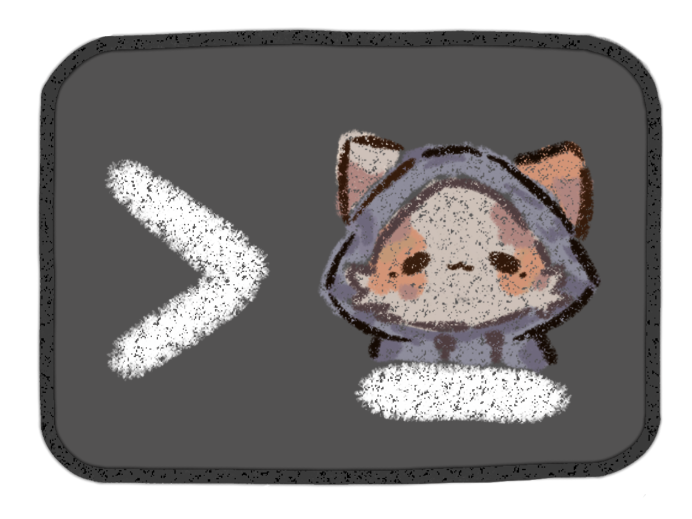
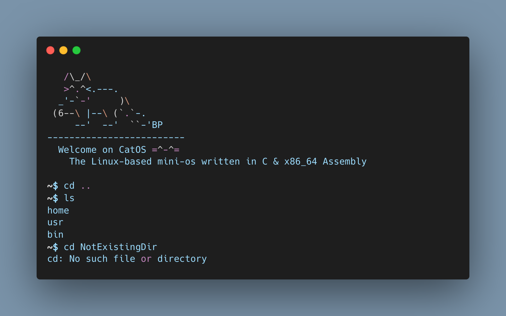

#  CatOS 

Previously named MiniShell, this project is a merge of MiniShell and LinuxFromScratch to create a simple, lightweight command-line OS. Written in C and Assembly, I built it from scratch to understand how a real operating system works.



<br>

<p align="center">
  
  
  
  
  
</p>


## Table of Contents

- [CatOS ](#catos-)
  - [Table of Contents](#table-of-contents)
  - [Features](#features)
    - [Main Functions](#main-functions)
    - [General](#general)
    - [Technical](#technical)
  - [Installation](#installation)
  - [License](#license)


## Features

### Main Functions

```C
void   put_char(const char *s);

int    str_len(const char *str);
char  *xstrdup(const char *s);

char  *read_line(void);
char **split_line(char *line);
void   free_argv(char **argv);

int    my_cd(char **argv);
int    my_ls(char **argv);

int    sh_loop(void);
```


### General
- Interactive prompt `$> `
- Input reading without `getline()` (manual reading via `read()`)
- User command parsing (`split_line`)
- Builtins:
  - `cd`, `cd -`, `cd <path>`, `cd` → `$HOME`
  - `ls [dir ...]`
  - `exit`
- Error handling (`perror`, consistent error messages)
- No memory leaks

### Technical
- No `realloc` or `strdup` (internal reimplementations)
- Direct use of POSIX system calls
- Portable compilation (macOS / Linux)
- Modular architecture (`lib` + `src` + `include`)


## Installation

Prerequisites \
  • Visual Studio Code (or other IDE) \
  • GCC or Clang (mac) \
  • Git

```bash
git clone https://github.com/dorydev/minishell.git
cd minishell
```


```bash
clang -std=c99 -Wall -Wextra -Werror -O2 -Iinclude \
  main.c src/mysh.c src/read_line.c src/split_line.c src/my_cd.c src/my_ls.c lib/put_char.c lib/xstrdup.c lib/str_len.c \
  -o minishell

./minishell

# or "make" when available.

```

## License

No licence for now

\
\
\
\
Project realised by **@dorydev**
